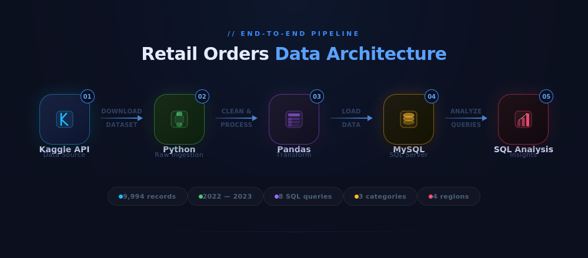

# 🛒 Retail Orders Data Analysis
### End-to-End Analytics Pipeline | Python · SQL · MySQL


---

## 📌 Project Overview

A full end-to-end data analytics project built on ~9,994 retail transactions (2022–2023) sourced from Kaggle. The pipeline covers **data ingestion → cleaning → transformation → SQL loading → business analysis**, answering 8 real-world business questions around revenue, regional performance, and year-over-year growth.

> **Skills Demonstrated:** Python (Pandas), SQL (Window Functions, CTEs, Conditional Aggregation), Data Cleaning & Feature Engineering, Business Insight Communication

---

## 🚩 Problem Statement

A retail company operating across multiple U.S. regions needed clarity on **where it was winning, where it was losing, and how to grow profitably.** Despite having two years of transaction data, there was no structured analysis to:

- Identify which **products** drove or drained revenue
- Understand **regional performance gaps**
- Track **month-over-month sales trends** across 2022 and 2023
- Pinpoint **which product sub-categories** were growing fastest in profit

**This project simulates the role of a data analyst hired to turn raw transactional data into actionable business strategy.**

---

## 🎯 Business Questions Answered

| # | Analysis |
|---|----------|
| 1 | 🔝 Top 10 highest revenue generating products |
| 2 | 🔻 Top 10 lowest revenue generating products |
| 3 | 🏷️ Revenue breakdown by product category |
| 4 | 🌍 Revenue breakdown by region |
| 5 | 📦 Top 5 best-selling products in each region |
| 6 | 📅 Month-over-month sales growth: 2022 vs 2023 |
| 7 | 🗓️ Best performing sales month for each category |
| 8 | 📈 Sub-category with highest profit growth (2023 vs 2022) |

---

## 💡 Key Business Insights & Recommendations

| # | Business Question | Insight | Recommendation |
|---|---|---|---|
| 1 | Top 10 revenue products | A small group of products drives disproportionate revenue | Prioritize inventory & marketing for these SKUs |
| 2 | Bottom 10 revenue products | Low-revenue products consume shelf space and operations cost | Consider discontinuing or bundling these products |
| 3 | Revenue by category | Category-level revenue varies significantly | Allocate promotional budgets to high-margin categories |
| 4 | Revenue by region | West & East are the highest-performing regions | Investigate South/Central for expansion or turnaround strategy |
| 5 | Top 5 products per region | Regional best-sellers differ from global ones | Tailor regional assortments based on local demand |
| 6 | Month-over-month growth (2022 vs 2023) | Reveals seasonal patterns and YoY momentum | Use trends to plan inventory builds and staffing |
| 7 | Best sales month per category | Peak months differ by category | Align promotions and discounts to category-specific peaks |
| 8 | Fastest-growing sub-category (profit) | Identifies the highest-growth opportunity in 2023 vs 2022 | Double down on the fastest-growing sub-category |

---

## 🏗️ Project Architecture



```
Kaggle API
    │
    ▼  Download Dataset (~9,994 rows)
Python (Raw CSV Data)
    │
    ▼  Data Cleaning & Feature Engineering (Pandas)
Python - Pandas (Cleaned DataFrame)
    │
    ▼  Load via SQLAlchemy + PyMySQL
MySQL Database
    │
    ▼  Advanced SQL Analysis (CTEs, Window Functions, Pivots)
Business Insights & Recommendations
```

---

## 🧹 Data Cleaning & Feature Engineering

The raw dataset required several transformations before analysis:

| Step | Action |
|------|--------|
| Null Handling | `'Not Available'` and `'unknown'` in `ship_mode` flagged as nulls via `na_values` |
| Column Standardization | Renamed all columns to lowercase with underscores (`order_date`, `sub_category`) |
| Feature: `discount_price` | Derived as `list_price × discount_percent × 0.01` |
| Feature: `sale_price` | Derived as `list_price − discount_price` |
| Feature: `profit` | Derived as `sale_price − cost_price` |
| Data Type Fix | `order_date` cast from `object` → `datetime64` using `pd.to_datetime()` |
| Column Pruning | Dropped `cost_price`, `list_price`, `discount_percent` after deriving needed columns |

---

## 🔑 SQL Highlights

The analysis uses advanced SQL techniques — not just basic queries:

```sql
-- Top 5 products per region using Window Functions
SELECT * FROM (
  SELECT region, sub_category, SUM(sale_price) AS sales,
         ROW_NUMBER() OVER (PARTITION BY region ORDER BY SUM(sale_price) DESC) AS rn
  FROM orders
  GROUP BY region, sub_category
) ranked
WHERE rn <= 5;

-- YoY Profit Growth using Conditional Aggregation (PIVOT-style)
WITH cte AS (
  SELECT sub_category,
    SUM(CASE WHEN YEAR(order_date) = 2022 THEN profit ELSE 0 END) AS profit_2022,
    SUM(CASE WHEN YEAR(order_date) = 2023 THEN profit ELSE 0 END) AS profit_2023
  FROM orders GROUP BY sub_category
)
SELECT sub_category,
       ROUND(((profit_2023 - profit_2022) * 100.0) / profit_2022, 2) AS yoy_growth_pct
FROM cte
ORDER BY yoy_growth_pct DESC
LIMIT 1;
```

**Techniques used:** `ROW_NUMBER() OVER (PARTITION BY ...)`, CTEs, `SUM(CASE WHEN ...)` pivot aggregation, YoY % growth formula

---

## 🗂️ Project Structure

```
📦 retail-orders-analysis
 ┣ 📂 notebooks/
 ┃ ┗ 📓 Data_Analysis.ipynb      # Data ingestion, cleaning & MySQL loading pipeline
 ┣ 📂 sql/
 ┃ ┗ 📄 Analysis.sql             # All 8 business analysis queries
 ┣ 📂 images/
 ┃ ┗ 🖼️  architecture.png        # Pipeline architecture diagram
 ┣ 📂 data/
 ┃ ┗ 📄 .gitkeep                 # Data downloaded via Kaggle API at runtime
 ┣ 📄 requirements.txt
 ┣ 📄 .gitignore
 ┣ 📄 LICENSE
 ┗ 📄 README.md
```

---

## 🛠️ Tech Stack

| Tool | Purpose |
|------|---------|
| Python 3.13 | Core scripting & pipeline orchestration |
| Pandas | Data cleaning, transformation & feature engineering |
| Kaggle API | Programmatic dataset ingestion |
| SQLAlchemy + PyMySQL | ORM-based data loading into MySQL |
| MySQL 8.x | Business analysis via SQL queries |
| Jupyter Notebook | Reproducible, documented analysis environment |

---

## ⚙️ Setup & How to Run

### Prerequisites
- Python 3.8+
- MySQL Server (local)
- Kaggle account with API key (`kaggle.json`)

### 1. Clone the repository
```bash
git clone https://github.com/chandupeddi/retail-orders-analysis.git
cd retail-orders-analysis
```

### 2. Install dependencies
```bash
pip install -r requirements.txt
```

### 3. Configure Kaggle API
```
~/.kaggle/kaggle.json          # Mac/Linux
C:\Users\<username>\.kaggle\kaggle.json   # Windows
```

### 4. Set up MySQL database
```sql
CREATE DATABASE orders;
```
Update your credentials in the notebook's `create_engine(...)` cell.

### 5. Run the Jupyter Notebook
```bash
jupyter notebook notebooks/Data_Analysis.ipynb
```
This downloads the dataset, cleans it, and loads it into MySQL.

### 6. Run SQL Analysis
Open `sql/Analysis.sql` in MySQL Workbench (or any MySQL client) and execute queries.

---

## 📁 Dataset

| Property | Detail |
|----------|--------|
| Source | [Kaggle — Retail Orders by Ankit Bansal](https://www.kaggle.com/datasets/ankitbansal06/retail-orders) |
| License | CC0 1.0 (Public Domain) |
| Records | ~9,994 retail transactions |
| Period | 2022–2023 |
| Key Fields | `order_id`, `order_date`, `ship_mode`, `segment`, `region`, `category`, `sub_category`, `product_id`, `sale_price`, `profit` |

> **Note:** Raw data is not committed to this repo. It is automatically downloaded via the Kaggle API when running the notebook.

---

## 📊 Key Insights

- 📦 Identified top and bottom 10 revenue-driving products to guide inventory decisions
- 🌍 Regional sales breakdown revealed West and East as highest-performing regions
- 📅 Month-over-month comparison between 2022 and 2023 tracked growth trends
- 🏷️ Category and sub-category analysis highlighted where profit margins were strongest
- 📈 YoY profit growth analysis pinpointed the fastest-growing sub-category in 2023

---

## 📋 Requirements

```
kaggle==2.0.0
pandas>=2.0.0
sqlalchemy>=2.0.0
pymysql>=1.1.0
jupyter>=1.0.0
notebook>=7.0.0
```

---

## 🙋 Author

**Peddi Chandu** — Aspiring Data Analyst passionate about turning raw data into business decisions.

[](https://github.com/chandupeddi)
[](https://www.linkedin.com/in/peddi-chandu/)

---

## 📄 License

This project is licensed under the MIT License — see the [LICENSE](LICENSE) file for details.
